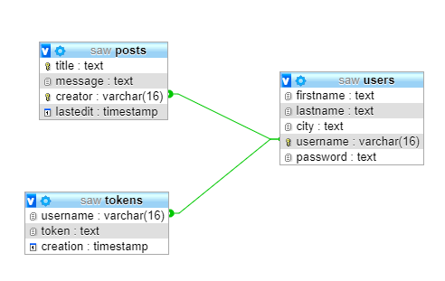

## Introduzione
il progetto che abbiamo sviluppato si basa sull’idea di fornire un servizio on-line su come compiere  piccoli lavoretti  e  la manutenzione generale su auto e moto di ogni tipo .  l’idea di base nasce dal fatto che spesso molti lavori come la ricarica della batteria  , il controllo dei livelli , la sostituzione delle lampadine bruciate ecc.. ci obbligano ad andare dal meccanico , ma in realtà molto spesso se ben guidati e  con un minimo di manualità queste azioni si possono compiere a casa risparmiando parecchio tempo e denaro . In particolare nel nostro sito web abbiamo sviluppato una sezione apposta “ tutorial “  dove è possibile cercare una soluzione al nostro problema.  

### Le componenti principali nella navigazione
la home:
nella home troviamo , un  menù  con le principali azioni che si possono compiere , scorrendo verso il basso troviamo dopo una breve descrizione  , una serie di immagini tramite le quali è possibile accedere ad ulteriori pagine specifiche ( temporaneamente in costruzione) dove vengono descritte alcune procedure , fra le più rilevanti.  

la registrazione : 
qui tramite un form richiediamo i principali dati personali , alcuni di questi potranno inoltre essere aggiunti in una fase successiva , dopo la registrazione automaticamente veniamo reinderizzati alla home  dove il menu permette la modifica e  il log-out del profilo 

login : 
un form specifico richiede l’inserimento dell’username e  della password in caso di inserimento corretto e di una precedente registrazione si accede correttamente  alla home “da utente registrato”

modifica profilo : 
il nostro sito permette la modifica delle credenziali dell’utente che si e registrato   (citta , nome, cognome, pwd, ecc.)
chi siamo : 
qui troviamo una piccola descrizione in merito agli sviluppatori dell’applicazione e di come tutto è nato .

### Tutorial : 
è l’elemento cardine del nostro sistema qui troviamo tutte le risorse che ci permettono di riparare il nostro veicolo . tutti gli utenti anche se non registrati hanno la possibilità di ricercare i tutorial.  la pubblicazione dei post è invece riservata esclusivamente agli utenti registrati , ogni post  è composto da un  titolo  che lo identifica  e dal testo relativo . a livello grafico sono ordinati per ordine cronologico di inserimento, dando precedenza ai post più recenti  . l’utente registrato ha inoltre la possibilità di eliminare i propri post tramite l’inserimento corretto del titolo.
 
### La nostra struttura dati 

la nostra struttura dati si basa su tre tabelle le quali ci permettono di gestire internamente gli utenti registrati ma anche i posto, in particolare:

“users” per  gestire i dati inseriti dall’utente  
“posts” per gestire i vari tutorial  
“tokens”  per gestire le “ sessioni “ 
 
### Caratteristiche 
 
per quanto riguarda la parte grafica l’intero progetto è stato sviluppato interamente con l’utilizzo di html5  e css , la pagine risultano responsive  e correttamente validate  in accordo con le specifiche del W3C.
 per il controllo dell’ input sfruttiamo i form ma alla stesso tempo effettuiamo analoghi controlli lato server .
nelle query sfruttiamo i prepare statement per rendere robusto il nostro sistema , inoltre anche nella gestione dei post e nella loro rappresentazione  abbiamo sfruttato i principali metodi per evitare possibili attacchi xss .
